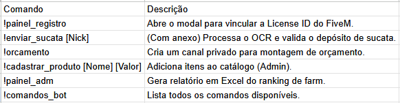

## Sistema Integrado de Gestão: OCR, Discord & Chatbot API 

* Este ecossistema de ferramentas foi desenvolvido para automatizar a gestão de recursos em servidores de jogo (FiveM), integrando processamento de imagem inteligente, automação via Discord e uma API de atendimento simulado.

## Componentes do Projeto

* Vinculo de identidade: Associa a license_id do FIVEM á conta do Discord.
* Validação por OCR: Ao receber um print do inventário, o bot utiliza o Google Cloud Vision para ler a quantidade de sucata e validar contra os logs do servidor.
* Auditoria Automática: Monitora canais de log em tempo real para detectar retiradas de itens e atualizar o saldo automaticamente.
* Sistema de Orçamento: Permite que usuários criem orçamentos privados em canais temporários, selecionando produtos de um catálogo dinâmico.
* Relatórios: Geração de planilhas Excel com o ranking de farm dos usuários. 

## Processador OCR (Google Cloud Vision)
Módulo especializado em tratamento de imagem para aumentar a precisão de leitura do texto. 

* Upscaling: Aumenta a resolução da imagem em 2x para melhor detecção.
* Ajuste de Contraste: Melhora a nitidez dos caracteres via PIL.ImageEnhance.
* Lógica Espacial: Filtra números baseando-se na proximidade da palavra-chave "SUCATA".

## Tecnlogia Utilizadas
* Linguagem: Python
* Bibliotecas: discord.py, mysql-connector-python, Pillow(PIL), Google Cloud Vision API, pandas, openpyxl 
* Banco de dados: MySQL

## Configuração e Instalação
* Python 3.8 ou superior instalado.
* Banco de dados MySQL configurado.
* Chave de API do Google Cloud Vision 
* Token de Bot do Discord 

## Passos para instalação
* 1. Clone o repositório 
```
git clone https://github.com/seu-usuario/seu-repositorio.git

```

* 2. Instale as dependências
```
pip install django djangorestframework django-cors-headers discord.py mysql-connector-python google-cloud-vision pillow pandas openpyxl

``` 

## Configuração de banco de dados

* Foi utilizado um banco de dados MySQL, para realizar o relacionamento de tabelas. 

### discord_fivem_map
```
CREATE TABLE discord_fivem_map (
    discord_id VARCHAR(50) PRIMARY KEY,
    license_id VARCHAR(100) NOT NULL,
    UNIQUE(license_id)
);
```

### inventario_sucata 
```
CREATE TABLE inventario_sucata (
    discord_id VARCHAR(50) PRIMARY KEY,
    discord_nick VARCHAR(100),
    total_sucata INT DEFAULT 0,
    audit VARCHAR(100) DEFAULT NULL 
);

```

### logs_processados 

```
CREATE TABLE logs_processados (
    log_discord_id VARCHAR(50) PRIMARY KEY,
    processado_em DATETIME DEFAULT CURRENT_TIMESTAMP
);

```

### produtos_cadastrados 

```
CREATE TABLE produtos_cadastrados (
    id INT AUTO_INCREMENT PRIMARY KEY,
    nome VARCHAR(100) NOT NULL UNIQUE,
    valor_base DECIMAL(10, 2) NOT NULL,
    cadastrado_por_discord_id VARCHAR(50),
    ativo BOOLEAN DEFAULT TRUE,
    criado_em DATETIME DEFAULT CURRENT_TIMESTAMP
);
```

### orcamentos_itens 

```
CREATE TABLE orcamentos_itens (
    id INT AUTO_INCREMENT PRIMARY KEY,
    discord_id VARCHAR(50) NOT NULL,
    nome_produto VARCHAR(100) NOT NULL,
    valor DECIMAL(10, 2) NOT NULL,
    quantidade INT DEFAULT 1,
    adicionado_em DATETIME DEFAULT CURRENT_TIMESTAMP
);
```

## Comandos do Bot (Discord)





## Estrutura do Projeto

```
├── src/                    # Código fonte da aplicação
│   ├── __init__.py
│   ├── discord_bot.py      # Script principal do bot
│   └── ocr_processor.py    # Módulo de visão computacional
│
├── assets/                 # Recursos estáticos
│   └── image.png           # Exemplo de print de inventário
│
├── logs/                   # Pasta para arquivos de depuração (JSON, logs de erro)
│   └── cloud_vision_spatial_debug.json
│
└── README.md               # Documentação atualizada

```

## Execução do projeto
* Este comando inicia o bot, o loop de auditoria e o processador de imagens:
```
python discord_bot.py

```

